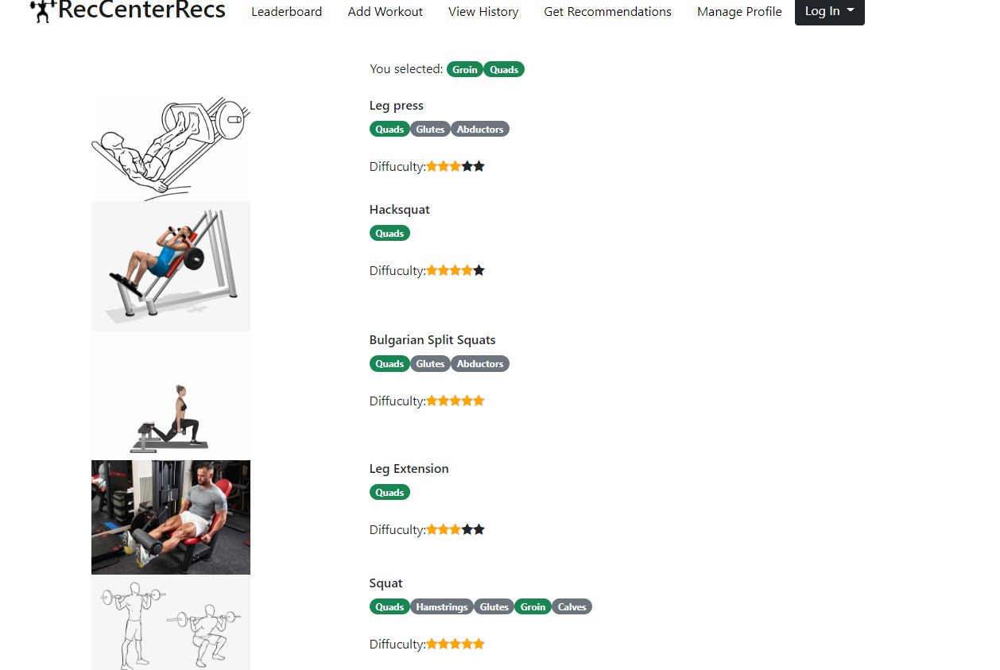

Team name: 05-spider

Application name:  Gym Recs

Semester: Spring 2022

# Overview:

Our application is an app that provides users with the ability to track their workouts, get specific exercise recommendations, and see how their workouts compare to other members of their community. Tracking and recording workouts is available for logged in users, and it lets them post new workouts with info such as exercises done, reps,sets, and weight used. These workouts are then available for them to view anytime. They can get exercise recommendations by inputting what body parts they want to work, and we will give them exercise they could do. Our workout leaderboard is our most innovative feature. It allows members of the Umass community to see how their workouts compare to other people at Umass, with the option to filter by features such as gender, clubs, major and body part. With all of these features combined into one app, our app is both unique and innovative. 

# Team Members: 

John Crowley - Jcrowley3612

Ethan Stafford- estaff2

Victoria Liu - vichliu

John Laidler - johnlaidler267

# User Interface:

	
	This shows our leaderboard. The top lifts sorted in descending order of weight are displayed in a table sortable by tags including major, club, year, and gender.

	
	This shows our Recommendations input page. Users can select what body parts they need recommendations for.

	
	This shows our page that gives users recommendations. It uses the body parts that were selected on the input page to show what exercises you should do.

	
	This shows our page for recording a new workout. Users can add pertinent information about their workout and save it to a table containing all workout data across the user base.

	
	This shows our login page. Users can log in here so that they can view their workout history and record new workouts. 
	
	
	This shows our sign up page. Users can sign up with username, email, password, schoolYear, major, gender.
	
	
	
	This allows a logged in user to log out.
	
	
	This allows users to update their profile by updating their password.

	
# API’s:
	
/register - This endpoint will allow for a new user to register for the system. When a user is signing up they will need to provide information including their name, email, password, school year, major, and gender. This is a POST operation. 

/login - This endpoint will allow a user to login in so that they can view their workout history or add a new workout. This will require the user to supply an email and password. Upon a successful login, the current user that is logged in will be put into localStorage so they can acquire personal information. This is a GET operation.

/leaderboard - This endpoint will get the workout history for every user and gather the highest weighted lifts which match the specified input tags. This is a GET operation 

/record - This endpoint will let a user post a workout with relevant information such as the exercise performed, the number of sets and reps, the weight used, and any additional notes they may have. This is a POST operation.

/user/history - This endpoint will allow the user to look at all of their past workouts that they have posted. This is a GET operation.

/exercises - This endpoint will get exercise that involves the body part that the user selected on the recommendation input page. This is a GET operation.

/user/update - This endpoint will let a user change personal information.  This is an UPDATE operation.

/user/logout - This endpoint will let a user logout.

/addExercise - This endpoint is only for administrators, it adds an exercise to our database of exercises. This is a POST operation.

# Databases: 

Exercise table - stores exercises that are used for recommendations 
| Column       | Data Type | Description                      | 
|--------------|-----------|--------------------------        |
| name         | String    | The name of the exercise         |
| difficulty   | integer   |A 1-5 rating of difficulty        |
| parts        | String[]  |All body parts this exercise works|

Users table -stores a user and their info

| Column       | Data Type | Description                | 
|--------------|-----------|--------------------------  |
| username     | String    | The username               |
| emailaddress | String    |The email address           |         
| password     | String    |The password                |
| schoolYear   | String    |The school year(senior etc.)|
| gender       | String    |Users gender                |
| major        | String    |Users major                 |
| club         | String    |A club they are apart of    |

Workout history table - Stores workouts for all users

| Column       | Data Type | Description                            | 
|--------------|-----------|--------------------------              |
| username     | String    |The user this entry is associated with |
| exercise     | String    |The name of the exercise                |         
| sets         | Integer   |Number of sets for that given exercise  |                          
| reps         | Integer   |Number of reps for that given exercise  |
| weights      | Integer   |Weight used for that given exercise     |                       
| notes        | String    |Additional notes                        |
| data         | String    |data the workout was done on            | 

# URL routes:

https://gym-recs.herokuapp.com/
https://gym-recs.herokuapp.com/landing_page/landing_page.html - These 2 URL’s go to the same place. They shows the leaderboard feature of our app which is also the page that you get if you visit just the base url.

https://gym-recs.herokuapp.com/record_workout/user_workout_record_page.html - This URL brings you to a page that will allow you to record a new workout, submitting new workouts is only functional for a logged in user. 

https://gym-recs.herokuapp.com/workout_history/user_workout_history.html - This URL will let you view your own workout history, this page is only usable for a logged in user. 

https://gym-recs.herokuapp.com/user_rec_input/user_rec_input.html - This URL will let you input what body parts you want exercise recommendations for. 

https://gym-recs.herokuapp.com/workout_recs/recs.HTML - This URL will see the exercise recommendations based on your input from the previous link, it is only intended to be accessed from user_rec_input.html   

https://gym-recs.herokuapp.com/edit_profile/edit_profile.html - This URL will let you change your username and password or delete a user profile 

https://gym-recs.herokuapp.com/login/login.html - This URL will let you login. 

https://gym-recs.herokuapp.com/logout/delete_user.html - This URL will let you log out.

# Authentication 

Users must be created first  with all 7 required input information. Then users are authenticated on the login page with associated username password through postgreSQL. Without user creation and login, users have no access to participate in leaderboard ranking or record workout history.

# Division of labor

**Ethan Stafford** - Responsible for all html/js/css/server/db implementation for the recommandations output page, as well as all the js and most of the html for recommendations input. Additionally, I did a lot of the implementation for heroku, the database, and the server. Wrote most documentation for the final milestone. 

**John Crowley** - Responsible for all the html/js/css/server/db implementations for the workout history page as well as the JS for login page and logout page as well as some HTML. Switched the server over to express and as well as inserted all valid exercises into our database. Wrote the rubric. 

**Victoria Liu** - Responsible for all the html/js/css/server/db implementations for the user register, login(error fixed with help), edit profile, and logout profile pages. Made the final video.Wrote authentication.

**John Laidler** - Responsible for the main leaderboard/landing page and the workout record page including front-end design with html/css and relevant back-end server/database calls for posting workouts and retrieving leaderboard data.

# Conclusion 

Our team learned a lot working on this project. The biggest challenge for this project was linking all the external libraries/services, and the general size of the project. Prior to this, most of us were used to working with a small number of files, and generally not having to worry much about using outside resources. However, for this website, we had to use bootstrap, express, postgresql, and heroku. It took us longer than expected to get all of these things figured out and troubleshooted. While these challenges tested our patience at times, we also learned a lot from them. Being familiar with all of these services is definitely important, even if we never use those exact services again, we are still a lot more familiar with what they do and the general idea of how they work, which is information that is valuable for any type of database or server library. I think the biggest thing we would have liked to know earlier is more info about the database. We had to change some of our data structures and code to make it fit, and some of this could have been prevented had we known more about this earlier. Overall, this project taught us a lot about dealing with larger scale projects and made us better programmers. 

# Rubric: 

