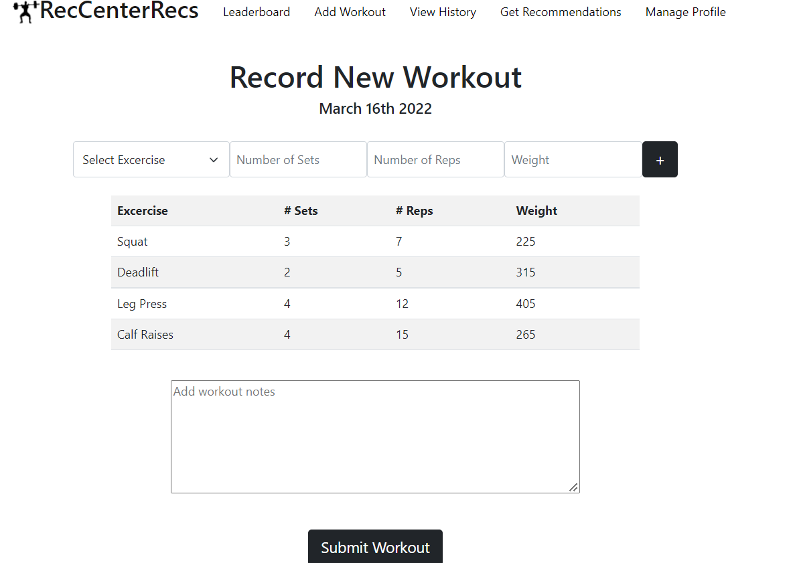
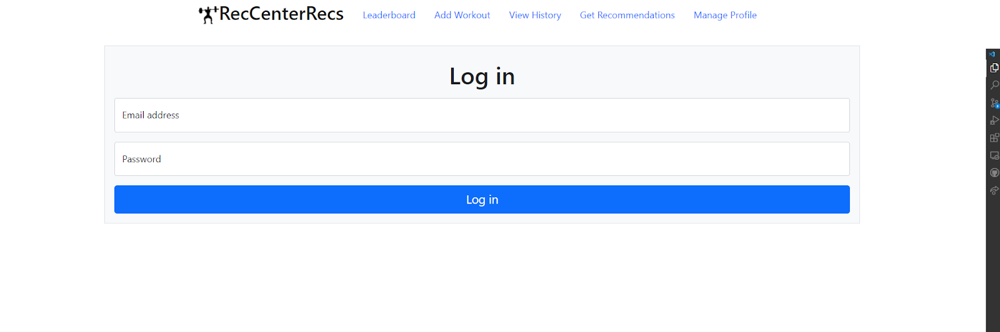
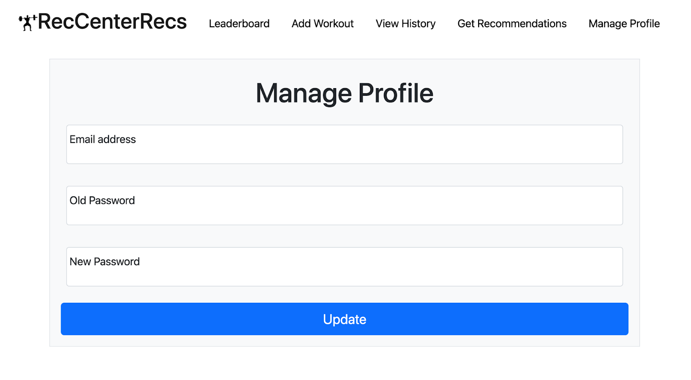
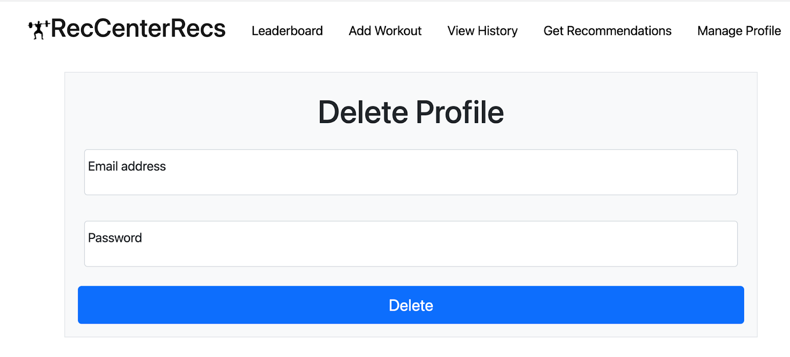

API’s (names may have to be changed based on what is actually written in server.js)

/register - This endpoint will allow for a new user to register for the system. When a user is signing up they will need to provide information including their name, email, password, school year, major, and gender. This is a POST operation. 

/login - This endpoint will allow a user to login in so that they can view their workout history or add a new workout. This will require the user to supply an email and password. Upon a successful login, the current user that is logged in will be put into localStorage so they can acquire personal information. This is a GET operation.

/leaderboard - This endpoint will get the workout history for every user and display the highest weights using the filters provided. This is a GET operation 

/record - This endpoint will let a user post a workout with relevant information such as the exercise performed, the number of sets and reps, the weight used, and any additional notes they may have. This is a POST operation.

/user/history - This endpoint will allow the user to look at all of their past workouts that they have posted. This is a GET operation.

/exercises - This endpoint will get exercise that involves the body part that the user selected on the recommendation input page. This is a GET operation.

/user/update - This endpoint will let a user change personal information. 

/user/delete - This endpoint will let a user delete their entire account

Screenshots:

This shows our interface for posting a workout. You select your machine and enter the relevant information. When you hit the submit workout button this information will be added to your user profile. This shows the interface for a POST request. 

This is the login page, upon entering your username and password a GET request will be sent to the server and a check to see if that user actually exists will be performed, if it does then you will be signed in and have access to your workout history and have the ability to add more workouts.

This page will let you update your password for your user profile

This page will let you delete a user profile.

Link to heroku: https://gym-recs.herokuapp.com/

Contributions: 
Ethan - Wrote all code for recommendation output, the recs js,html, and css files. I additionally wrote all related server GET requests for this involving the data from exercises.json, I also wrote the code for nav bar functionality. I also wrote the API descriptions. Due to a last minute heroku deployment the recs server request is currently not working, but will be fixed shortly after the deadline.

John C.- Attempted to write code for workout history html, js, and css. Attempted to add a GET request for user/history as well. Hope to fix and re push following the deadline after working with TA or other resources. 

Victoria - Handled login js/html code and server side, as well as user recommendation input

John L.  Handled leaderboard js/html code and server side, as well as posting a workout
