Team Members
John Crowley - Jcrowley3612
Ethan Stafford- estaff2
Victoria Liu - vichliu
John Laidler - johnlaidler267
Idea Overview
The most basic layer of our website is a gym tracking and recommendation system. This means that we will need to give users the ability to write down what workouts they did in the past and keep track of them for future reference. Users will also be able to receive recommendations for what workouts they should do based on what muscle groups they want to target. This recommendation will include pictures of the equipment needed at the UMass rec center, and possibly a video of how to do the exercise. 
	Beyond those basic functions, we will give users the ability to keep track of their personal records for various exercises. These personal records will go into a public leaderboard where users can see the top records and filter by things such as major, year, and goal, providing a competitive aspect to the app. There may also be other parts of the leaderboard, such as the longest gym streak. 

Part 0: data interactions
Users will input past workouts
Users will type in what parts of their body they want to work onto into the recommender 
Users will create profiles (adding information for name, email, school year, etc..)
Users can filter their personal workout history by body part worked 
Users can filter the leaderboard on year, major, exercise

	
Part 1: user interface (screenshots of wireframes)
User profile creation:
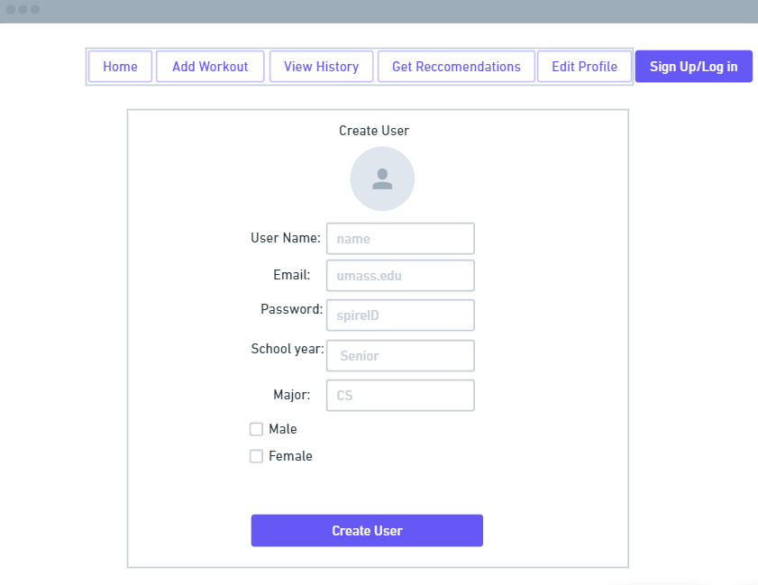

Landing page/leaderboard:
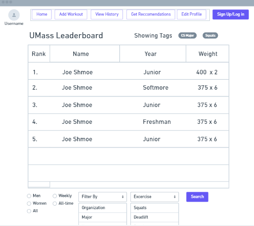

User Workout history:
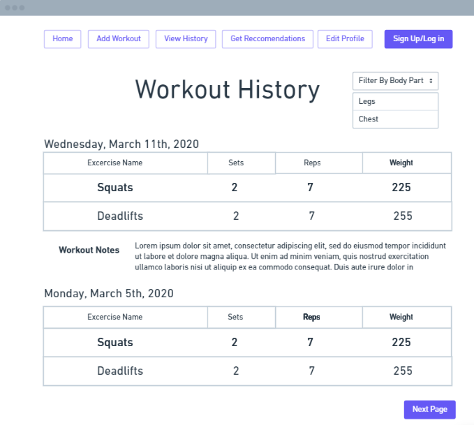

Record workout page:
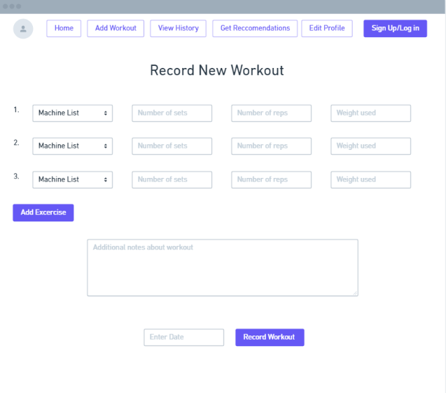

User recommendation input: 
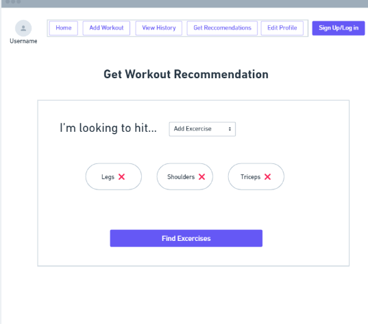

User workout recommandations: 

Part 2: screenshots of HTML pages
User profile creation:
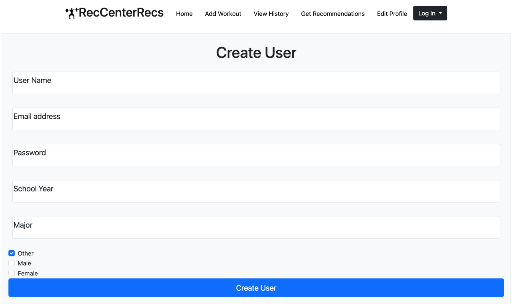
Landing page/leaderboard:
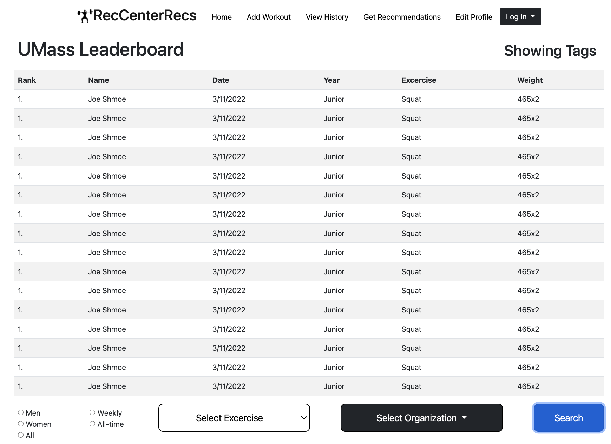
User Workout history:
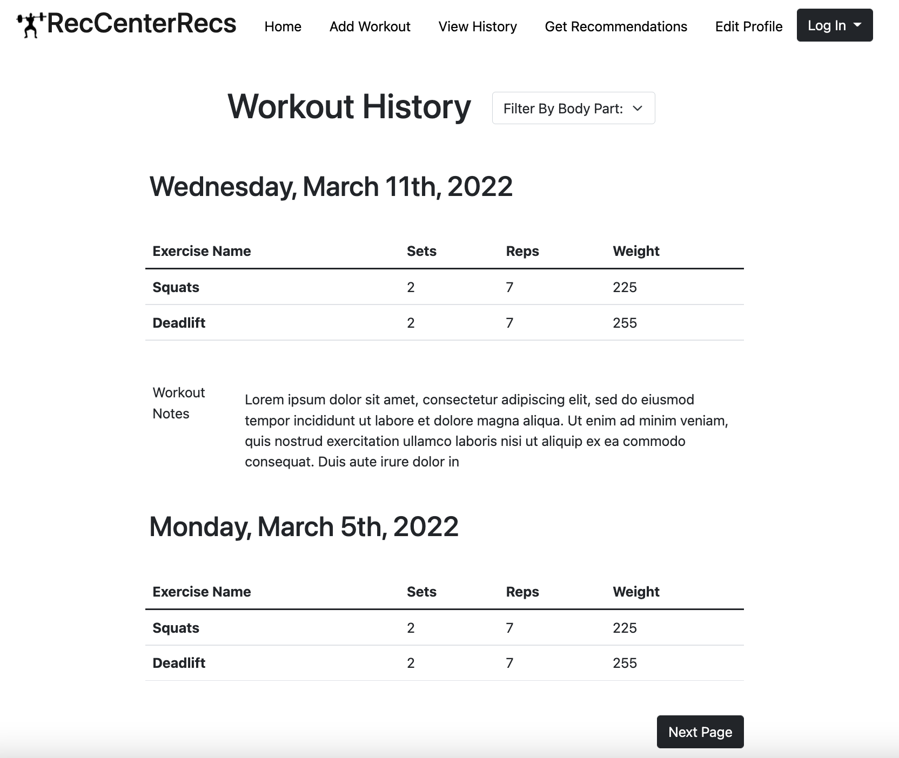

Record workout page:
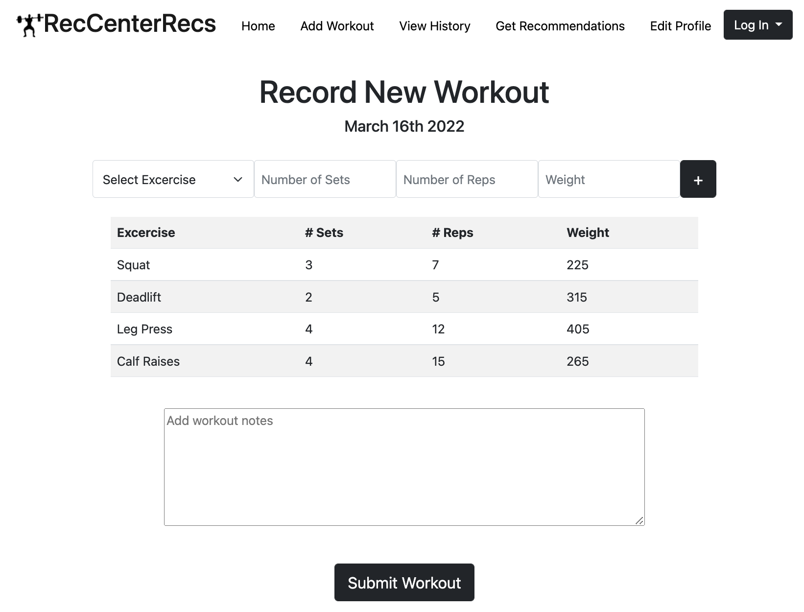 

User recommendation input:
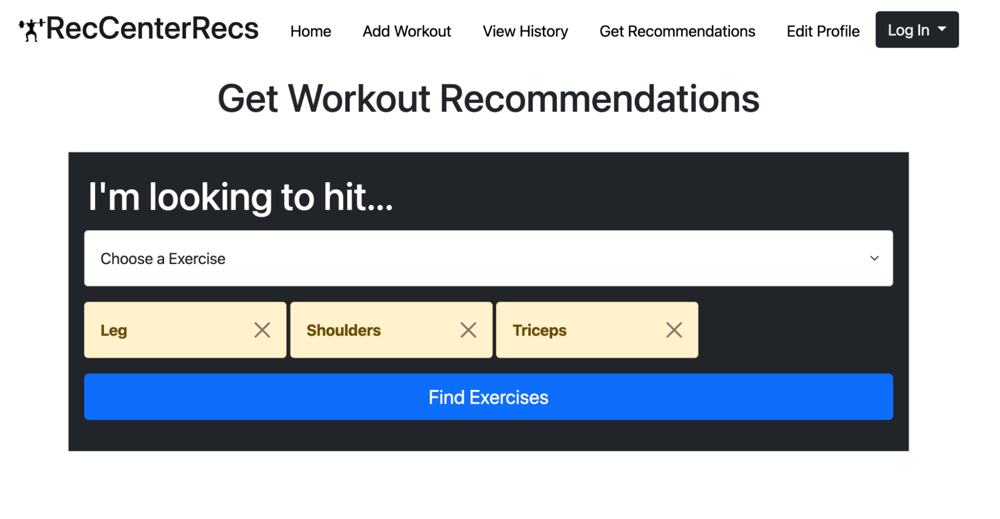

User Recommendations:
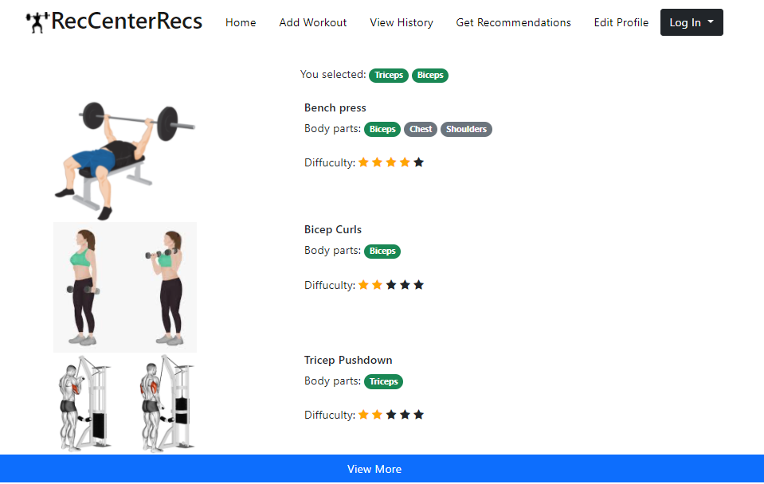

Part 3: Contributions

Ethan Stafford - I created the HTML and CSS for the user recommendation page, and I made the wireframes for the user recommendation page and the user workout record page

John Laidler - Helped make the wireframes for the landing page, user workout creation, user workout history, and did the HTML/CSS for landing page and user workout creation pages.

John Crowley - I did the HTML and CSS for the user workout history page and the data interactions and idea overview 

Victoria Liu - I created the HTML and CSS for profile creation and user recommendation page 

